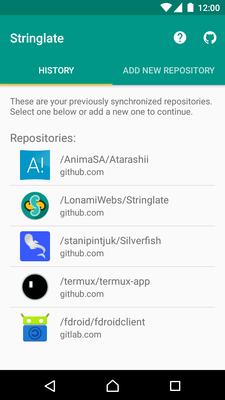
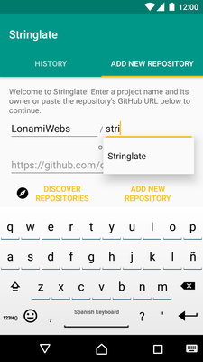
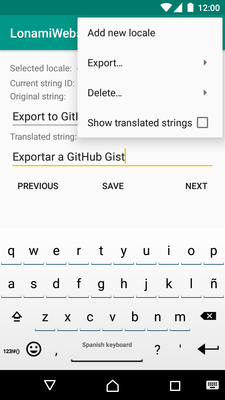

# Stringlate
*Help translating FOSS applications.*

## Description
This application was born to help the FOSS community translate their Android
applications in an easy way. Perhaps your family doesn't know enough English
and you might want to translate a FOSS application for them, then this is
application is the right way to go.

Its purpose is **fetching** a GitHub repository containing the **source code**
for an Android application, and once the `strings.xml` files in it are
downloaded, you'll be able to **translate it** whenever you want.

Some applications have a large amount of `strings` waiting to be translated.
This is the reason why it's not a desktop application, so it could be done
anywhere (*no internet connection is required* once the `strings` are saved).
Once you're done, create a *Gist*, **export** the file to the SD card or simply
copy its contents to the clipboard.

Of course, once you have the final `strings.xml`, drop the author an issue and
let them know you've translated their application. They'll be really happy!

## Help
Still have questions on how to use the application? Check out the links below
to get more help on your own language (or one you're able to talk):
- [English](help/en.md)

## Permissions
- **Internet**. Required to be able to fetch a remote GitHub repository in
  order to download its contents. Also used to post a GitHub *Gist* and to
  load the *Discover* activity.

## Notes
This application has not yet been tested on pre-Lollipop devices and it
*might* fail on some operations, such as exporting a file to the SD card. If
this is the case, please let me know, or create a new pull request with a fix.

## Screenshots

## Donations
At the moment I don't have any donating system. However, if you really are
interested, please drop an issue on GitHub and I'll take a look at it. You
would be my first donor!

## License
The project is licensed under the
[MIT License](https://github.com/LonamiWebs/Stringlate/blob/master/LICENSE).
